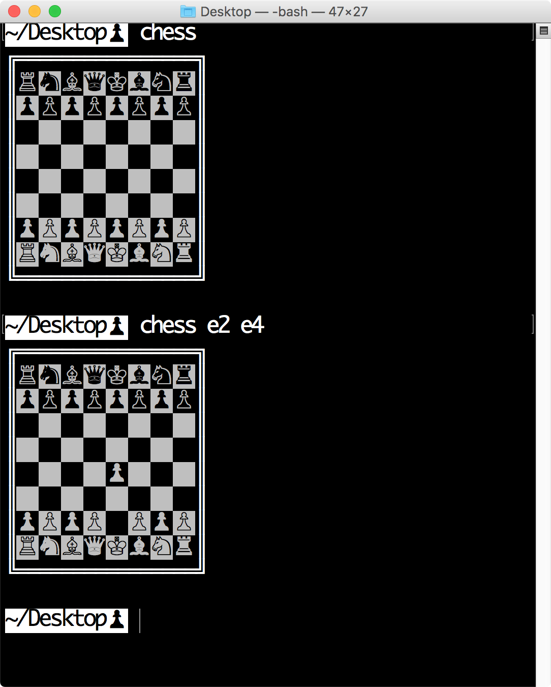
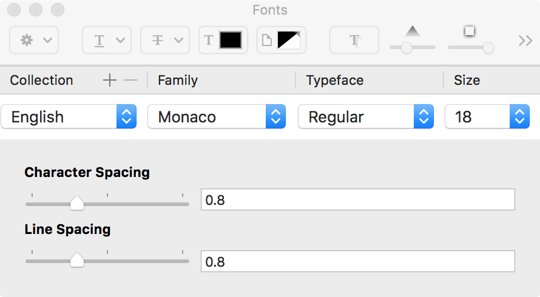

# Instructions
Copy the chess.py file somewhere on your PATH, rename the file to `chess`, and run `chmod +x chess`

Display looks best with character spacing = 0.8, line spacing = 0.8, size 18 Monaco font, and then `command +`'d 4 times.

